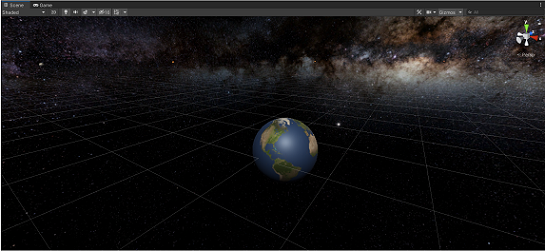
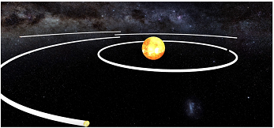
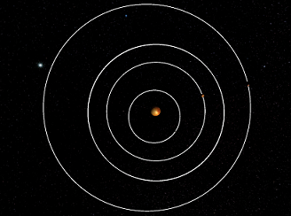
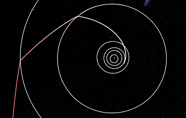

# Virtual Reality Solar-Sytem Grand Tour Unity

## Introduction
The objective was to recreate a simulation of Voyager 2's grand-tour of the solar-system using Newtonian mechanics and gravity assist as part of my final undergraduate project. The theory, development and analysis can be viewed in the [report](report.pdf), while the Unity project **FinalBuild** can be loaded in the editor and an executable can be built. This project was built with the contributions of [IreliaLeaf](https://github.com/IreliaLeaf), with his focuses outlined in the [report](report.pdf).

## Prerequisites
- Unity Editor Version: 2020.3.27f1
- VR Headset: Oculus Rift + Touch
- PC or Unix system with video card

## Files
Along with the individual [report](report.pdf), a scientific presentation [poster](poster.pdf) was produced with a group of similar Astrophyics projects utilising the Unity engine. 

[main.py](main.py) was a constructed unit velocity vector calculator which was used to implement elliptical orbits of the planets using only 5 position vectors from the [NASA-Horizons](https://ssd.jpl.nasa.gov/horizons/app.html#/) ephemerides, hence calculating a 5-point conic equation using linear algebra. The development of this tool can be found in the [report](report.pdf).

## Videos and Media
Below is a short trailer of the grand-tour and fly-bys in action.

Orbital trajectories of the planets and Voyager 2.

